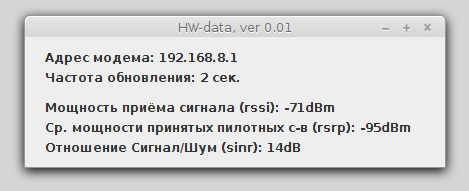

# HuaweiModemData

Графическая программа для визуализации показаний с 4G-модема с периодическим опросом. То есть раз в 2 секунды (или сколько указано в настройках) запрашиваются данные по модему. Мне это нужно было, чтобы настроить внешнюю антену на максимальный приём.


Проверено на:

* МТС 827F(Huawei 3372-H)

Поддерживает (проверено на):

* Linux Mint

* Windows 7

* Windows 10


#### Настройка

Произвонится в файле settings.xml, который должен находится в директории с HuaweiModemReader.jar.

Содержимое файла:

```
<?xml version="1.0" encoding="UTF-8"?>

<!-- program configuration -->
<settings>
  <ipModem>192.168.8.1</ipModem>
  <updateSec>2</updateSec>
</settings>
```

где просто указаны ip модема и частота обновлений в секундах. После запуска получается такая картинка:





----

#### Использование

Копируете содержимое dist в удобное место.

В ту же папку кладёте settings.xml и вашими данными

Запускаете либо в консоли (java -jar HuaweiModemReader.jar) или просто сделайте bat/sh файлик для запуска


----
Пожалуйста, если есть предложения и пожелания, напишите мне об этом.

----
Выкладывать на других сайтах нет смысла, лучше сделать ссылку сюда: встроенной системы обновлений нет.

